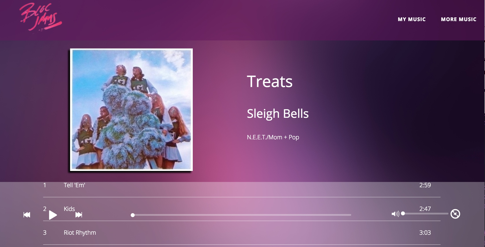

**Bloc Jams AngularJS**

Bloc Jams is a compact, light-weight music player built in Angular, using jQuery, vanilla JavaScript, and several outside libraries to offer fun listening experience to users. This project featured my first in-depth use of the Angular framework, which I immediately took to. I had an intuitive feel for the modularity and elegance of the Model-View-Controller framework, and used that to break out the functions of a music player across the breadth of an Angular app.



In building Bloc Jams, I did hit some stumbling blocks. In particular, for a time the various links on the Collection Page all pointed to the same place, even if they referred to different albums. I got around that issue by making use of URL queries and the QueryData library. By inserting readable information into the URLs of the various links, I was able to use the QueryData information to tell the rest of the code which album to load. Some of the relevant code is on display below:

```javascript

var albumPicker = function() {
  var queryData = new QueryData;
  if(queryData.albumID === '1') {
    setCurrentAlbum(albumBonIver);
  }
  else if(queryData.albumID === '2') {
    setCurrentAlbum(albumFooFighters);
  }
  else if(queryData.albumID === '3') {
    setCurrentAlbum(albumSufjan);
  }
}

```


You can check out Bloc Jams and listen to some good tunes [here.](https://bloc-jammr.herokuapp.com) Happy listening!
